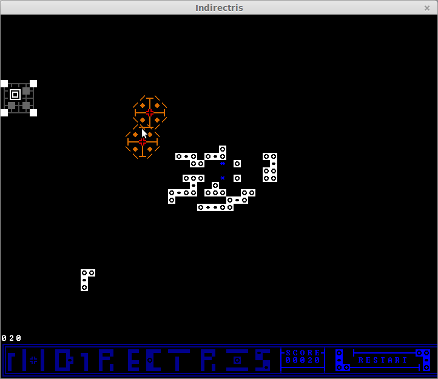

## Bear hug

### What is it?
A bearlibterminal wrapper for building ASCII-art games and apps in python3.6+.
Although based on the [bearlibterminal](http://foo.wyrd.name/en:bearlibterminal)
library, which is mostly used in roguelikes, it is centered mostly on
multi-character widgets, not lonely `@`s and `d`s of the roguelike tradition.

### What it is not?
Curses analogue. Bearlibterminal does
not rely on the user console, instead building its own SDL window. It
means the end result looks the same whether the player of
`bearlibterminal`/`bear_hug` game runs it on any Linux flavor, MacOS or
Windows. In addition, you get some cool tricks from `bearlibterminal`, for
examlpe overlapping characters.

But it also means that any system that cannot run SDL cannot run
`bearlibterminal` games.

### What's there now?
A loop and event system, a bunch of Widget classes (including layouts),
object-oriented Widget API, parsers for txt and `.xp`
([REXPaint](https://www.gridsagegames.com/rexpaint/)) image formats, WAV sound,
ECS support (base Entity/Component classes and some universally useful
subclasses like WidgetComponent for the display and CollisionComponent to
process collisions).

### What's planned?
A scene manager, better animation, more widgets, more file formats,
better settings API, more useful components for your gamedev needs, proper
font support.

By the way, pull requests are always welcome.

### Any examples of the games made with `bear_hug`?
I've used it for a [gravity-controlled Tetris variant](https://ldjam.com/events/ludum-dare/41/indirectris):

You can also check out [the repo for my beat-em-up](https://github.com/synedraacus/brutality).
It's in a very early stage of development, though.  

### Where's the documentation?
API reference is available [here](https://bear-hug.readthedocs.io/en/latest/).
A quickstart guide is currently being written. 

### What are the dependencies?
Bearlibterminal and Python3.6+. To use sound, you will also need
[simpleaudio](https://simpleaudio.readthedocs.io/en/latest/).

### What's the license?
MIT, copyright 2018-2019, A. A. Morozov.
